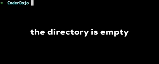

# README

Find an online playable version of the game at https://sartellcoderdojo.org/echo-shooter/

## Getting started
To work on this project, follow these instructions

### Install Git
Install git from https://git-scm.com/. Download the installation file appropriate
for your Operating System, run the installation file, and follow the prompts it
provides.

Once installed, verify your installation, open a command prompt (or Git-Bash
program for Windows users) and type `git --version` at the prompt and then hit the
Return (or Enter) key. If successful, the program should respond with the installed
version number.

### Checkout the code
To checkout the code, open up a terminal (AKA command prompt) on your system. Then
change directory (`cd`) to the directory you want to checkout to and execute
the following git command:

`git clone https://github.com/sartell-coder-dojo/echo-shooter.git`

### Create a branch
If you would like to keep your changes separate from anyone else working on the
project, it is advised to create a new branch for your work. To create a branch
run the following command:

`git branch my-branch-name`

Then "checkout" that branch to switch to it:

`git checkout my-branch-name`

To save time, you can create a new branch and checkout that branch in one command
using the `-b <branch-name>` flag on the `checkout` command:

`git checkout -b my-branch-name`

Verify you are on the expected branch by running `git status` which should tell
you the name of the branch you're currently on.

### Make your changes
Once you have created and checked out your branch, you can modify your code as
usual without worrying that your changes will interfere with anyone else.

to be continued...
